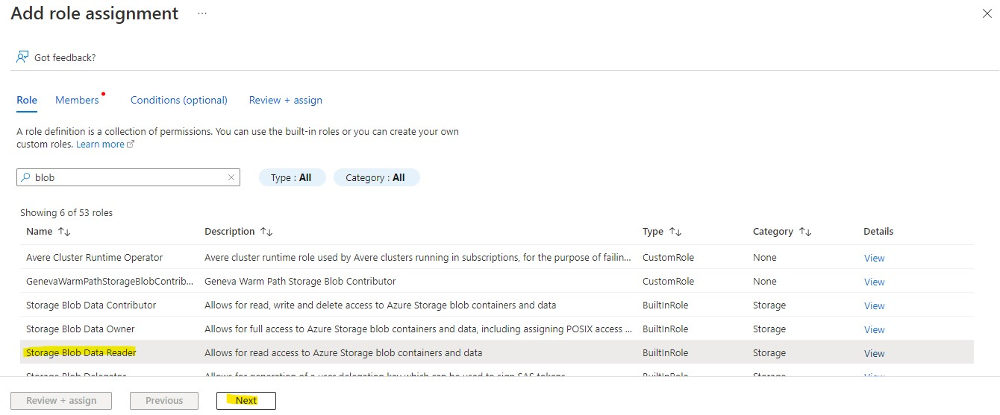
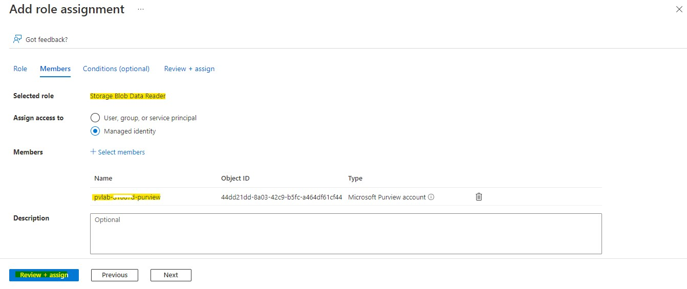
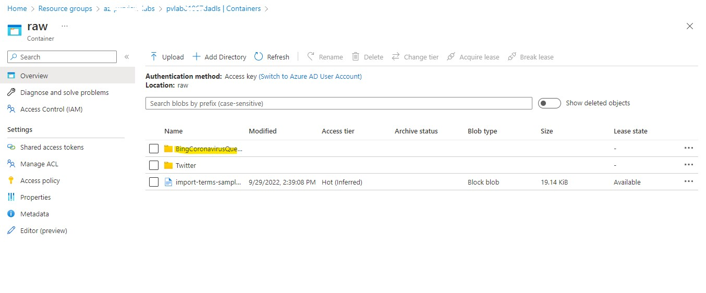
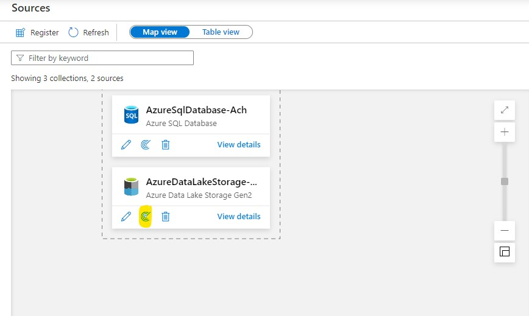
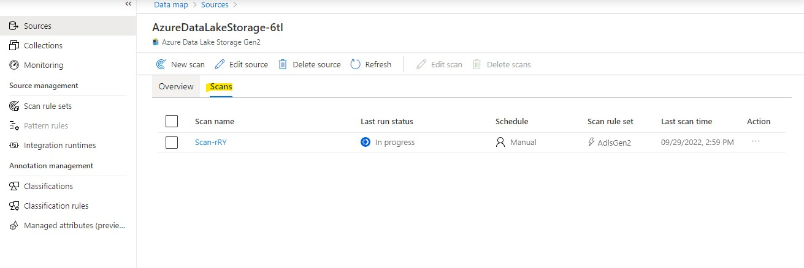

# Registering & Scanning SQL DB source and ADLS Gen2 Account

To populate Microsoft Purview with assets for data discovery and understanding, we must register sources so that we can leverage the scanning capabilities. 
Scanning enables Microsoft Purview to extract technical metadata such as the fully qualified name, schema and data types.

In this demo, you'll walk through how to register and scan data sources.

## Objectives:

- By the end of this module you'll have technical metadata, such as schema information, stored in Purview. 
- You can use this to start linking to business terms, allowing your team members to find data more easily which will be demonstrated in the upcoming demos.

## Pre-requisites:

- An *Azure account* with an active *subscription*
- An *Azure SQL Server* and an *Azure SQL Database*
- An Azure Data Lake Storage Gen2 Account
- BingCoronavirusQuerySet files in Gen2 storage Account.
- Users should have *Data Source Admin permission* to register a data source and *Collection Admin* access in the Purview Account.

## A. Registering and Scanning SQL Database:

1. Go to **Data Map** -> **Sources** -> **Expand** the Root Collection to **Contoso**.

2. Click on the **Register icon** in the Contoso Collection.

   

3. Search for **Azure SQL Database** in the Register sources blade.

   

4. Fill in the data source **name** as `Sqldb`, select the Azure subscription and sql server name where the database is located.

   

5. Select a collection: ```pvlab-{randomid}-purview>Contoso``` and click **Register**.

6. The created data source will be put under the selected collection, **Contoso**. Click **View details** to see the data source.

   

### Scanning SQL DB:

1. Before Scanning the data source. Go to the **resource group** in the **azure portal**.

2. Go to the **SQL Server**. Navigate to **Azure Active Directory**. Click **Set Admin**.
   Provide the Purview account **Managed Identity, [pvlab-{randomid}-purview]** and **Save**.

   

   

3. Go to the **SQL Database** in the **Azure Portal**. Click on **Set Firewall**. Under **Firewall Rules** tab,
   **Add Client IPv4 address**, **toggle on** the **Exceptions**, allowing azure resources and services to access the server and **Save**.
   
   

   

4. Now go to **Purview workspace**, Click **New Scan** in the registered SQL DB source.
   
   

5. Provide the Scan **name** as `Scan-db`, Database name, Credential, select a collection.
   
   
   
6. **Test Connection**, once the scan is **Successful**, click **Continue**.

> If the Scan is failed, then you forget to add the client ip address to Firewall in Azure SQL database and set admin in sql server.

7. In the **Scope your scan** blade, Select the AzureSQLDatabase and **Continue**.
   
   

8. Select the _System Default_ Scan rule set and **Continue**.

   
   
9. Set the scan trigger as **Once** and **Continue**.
   
   
   
> Now you can either select a recurring scan or one time, in our case we will select “ONCE.” 
> In case you have selected recurring, it will be scanning all assets in that scope based on the schedule you provide. 

10. Review, Save and Run the scan.

    
    
11. You can view the details of the scan in the Source page.

    
    
    

12. Once the scan is successfully completed, view the number of assets in the **Overview** section.

13. The source registered in the *Contoso* collection can also be moved to any other collection by the *Move* option provided in the details page.

    
    
    

## B. Registering and Scanning of ADLS Gen2 Account

Now you'll walk through how to register and scan ADLS Gen2 account. You'll register a ADLS Gen2 account and configure scanning. 

### Grant the Microsoft Purview Managed Identity Access

1. Navigate to your Azure Data Lake Storage Gen2 account (e.g. `pvlab{randomId}adls`) and select **Access Control (IAM)** from the left navigation menu. Click **Add role assignment**.

    
  
2. Filter the list of roles by searching for `Storage Blob Data Reader`, click the row to select the role, and then click **Next**.

    

3. Under **Assign access to**, select **Managed identity**, click **+ Select members**, select **Microsoft Purview account** from the **Managed Identity** drop-down menu, select the managed identity for your Microsoft Purview account (e.g. `pvlab-{randomId}-pv`), click **Select**. Finally, click **Review + assign**.

    
    
    

4. Click **Review + assign** once more to perform the role assignment.

    

5. To confirm the role has been assigned, navigate to the **Role assignments** tab and filter the **Scope** to `This resource`. You should be able to see that the Microsoft Purview managed identity has been granted the **Storage Blob Data Reader** role.

    
    
### Upload Data to Azure Data Lake Storage Gen2 Account

This Step is already done for you. To confirm the file is present inside ADLS Gen2 Storage account, Navigate to your Azure Data Lake Storage Gen2 account (e.g. `pvlab{randomId}adls`) and select **Containers** from the left navigation menu. Click on **raw** container. Inside you will see a folder with the name **BingCoronavirusQuerySet**.


    

### Register a Source (ADLS Gen2)

1. Open the **Microsoft Purview Governance Portal**, navigate to **Data Map** > **Sources** > **Contoso** collection, click on **Register** icon.

    

2. Search for `Data Lake`, select **Azure Data Lake Storage Gen2**, and click **Continue**.

    

3. Fill in the **name** as `ADLS-Gen2`. Select the **Azure subscription**, **Storage account name**, **Collection**, and click **Register**.

    


### Scan a Source with the Microsoft Purview Managed Identity

1. Open the **Microsoft Purview Governance Portal**, navigate to **Data Map** > **Sources**, and within the Azure Data Lake Storage Gen2 tile, click the **New Scan** button. Give the **Scan name** as `Scan-adls`.

    

2. Click **Test connection** to ensure the Microsoft Purview managed identity has the appropriate level of access to read the Azure Data Lake Storage Gen2 account. If successful, click **Continue**.

    

3. Expand the hierarchy to see which assets will be within the scans scope, and click **Continue**.

    

4. Select the system default scan rule set and click **Continue**.

    

5. Select **Once** and click **Continue**.

    

6. Click **Save and Run**.

    

7. To monitor the progress of the scan run, click **View Details**.

    

8. Click **Refresh** to periodically update the status of the scan. Note: It will take approximately 5 to 10 minutes to complete.

    
    


[ ⏮️ Previous Module](../01_creating-collection-and-adding-role-assignments/documentation.md) - [Next Module ⏭️ ](../03_registering-and-scanning-an-on-premises-sql-server-instance/documentation.md)
