# Maintaining Glossary by Creating and Importing Terms

A glossary provides vocabulary for business users. 
It consists of business terms that can be related to each other and allows them to be categorized so that they can be understood in different contexts.
These terms can be then mapped to assets like a database, tables, columns, etc.
This helps in abstracting the technical jargon associated with the data repositories and allows the business user to discover and work with data in the 
vocabulary that is more familiar to them.
A business glossary is a collection of terms. 
Each term represents an object in an organization and it is highly likely that there are multiple terms representing the same object. 
These multiple terms havea relationship with each other.

In this demo you learn how to create terms using a system and custom term template. 
You'll also learn how to import and export terms. Lastly, you learn about linking terms to data assets, 
which helps to relate technical metadata to business metadata.

## Prerequisites

* An *Azure account* with an *active subscription*.
* A **import-terms-sample.csv** file in the **pvlab{randomid}adls** storage account.
* User should have *Data Curator* and *Data Reader* Roles.

## Objectives

* **Create a Term** in the Glossary using the **System Default Term Template**.
* **Create a Term** in the Glossary using a **Custom Term Template**.
* **Bulk Import Terms** into the Glossary via a CSV file.
* **Bulk Export Terms** from the Glossary into a CSV file.
* **Assign a Term** to an Asset in the Data Catalog.
* **Update an existing Term** with Related Terms and Contacts.
* **Unassign a Term**.

## Create a Term (System Default Term Template)

1. Open the **Microsoft Purview Governance Portal** and from the **Data catalog**, click **Glossary** (or) Open the **Manage Glossary** tile.

   

2. Click **New term**.

   

3. Select the **System default** term template and click **Continue**.

   A **Term Template** determines the attributes for a term. The **System default** term template has basic fields only (e.g. Name, Definition, Status, etc). **Custom** term templates on the other hand, can be used to capture additional custom attributes.

   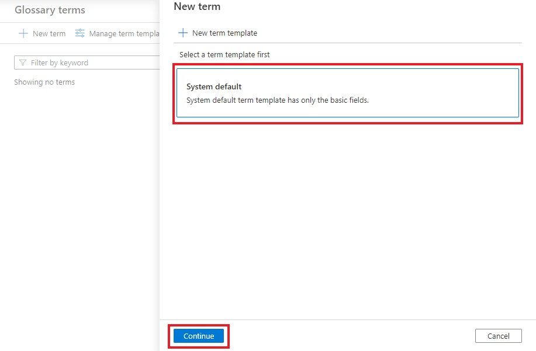

4. Change the **Status** of the term to `Approved` and then fill the values below into the appropriate field, then click **Create**.
   Field | Definition
   --- | ---
	 Name | ``Contoso Parent``
   Definition | ``This will be the parent term``
   Acronym | ``CP``
   Resource Name | ``Microsoft Purview``
   Resource Link | ``https://aka.ms/Azure-Purview``

   
   
   

## Create a Term (Custom Term Template)

1. Click **New term**.

   

2. Click **New term template**.

   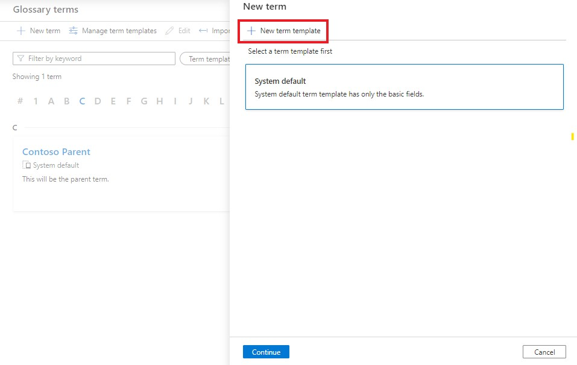

4. Specify a **Template name** (e.g. ""``Contoso Template``"") and click **New attribute**.

   

5. Populate the attribute fields as per the examples below and click **Apply**.
   Field | Definition
   --- | ---
	 Attribute Name | ``Business Unit``
   Field Type | ``Single Choice``
   Choices | ``Sales, Marketing, Finance, Human Resources, IT``
   
   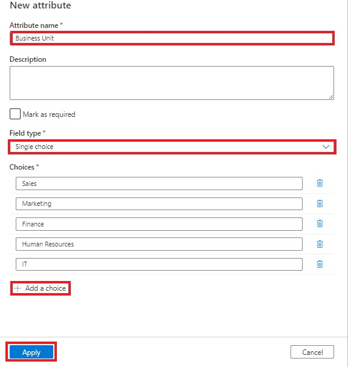

	> Field Type Options:
	> Single Choice- Can select only one in the given choice list
	> Multiple Choice- Can select multiple fields
	> Text- Include text
	> Date- Can select a date
	> In this demo, we are using **single choice**.

6. Click **Create**.

   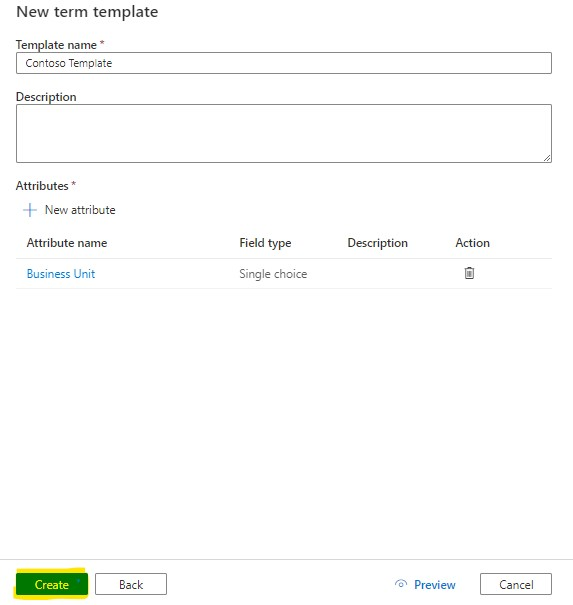

7. Select **Contoso Template** and click **Continue**.

   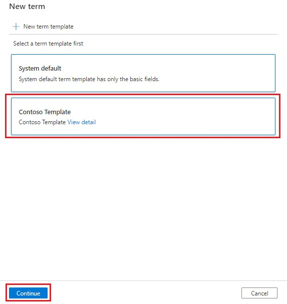

8. Change the **Status** of the term to `Approved` and then **copy** and **paste** the values below into the appropriate field, then click **Create**.
   Field | Definition
   --- | ---
	 Name | ``Contoso Child``
   Definition | ``This will be the child term``
   Acronym | ``CC``
   Parent | ``Contoso Parent``
   Business Unit | ``Marketing``
	
   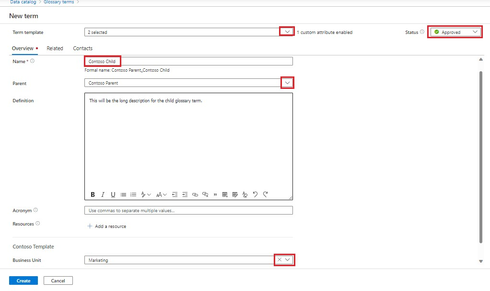
   
9. From the **Glossary** screen, change the view to **Hierarchical view** to see the hierarchical glossary.

   

## Bulk Import Terms

1. Download a copy of **import-terms-sample.csv** to your local machine from the **pvlab{randomid}adls** storage account.

   Go to **pvlab{randomid}adls** -> **raw** -> **import-terms-sample.csv** -> **Download**

   

2. From the **Glossary** screen, click **Import terms**.

   

3. Select the **System default** term template and click **Continue**.

   

4. Click **Browse** and open the local copy of **import-terms-sample.csv**.

   

5. Click **OK**.

6. Once complete, you should see 50 additional terms beneath the parent (Workplace Analytics). 

   You can quickly find specific types of terms using the filters at the top (e.g. Status = Approved, Expired, Draft).

   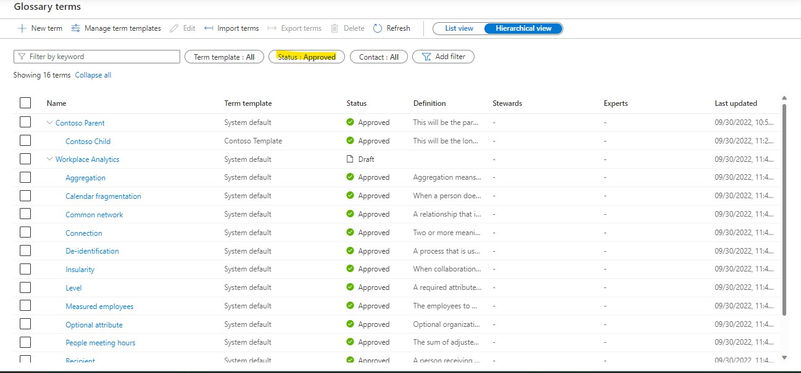

## Bulk Export Terms

1. From the **Glossary** screen, we want to select ALL terms (top check box) and then de-select terms that do not belong to Workplace Analytics (i.e. Contoso Parent, Contoso Child). **All Workplace Analytics terms** should be selected. Click **Export terms**. 

   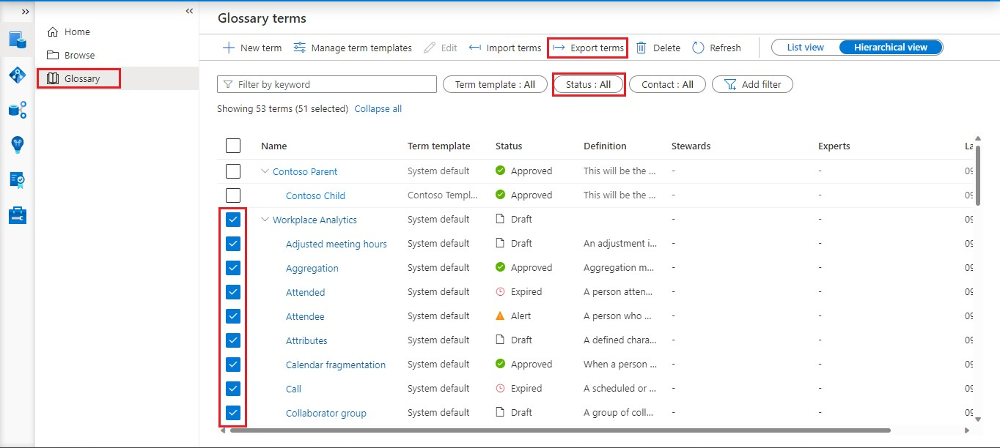

2. If the export was successful, you should find a **CSV** file has been copied to your local machine (e.g. Downloads).

   

## Assign a Term to an Asset

1. Perform a wildcard search by typing asterisk (**\***) into the search bar and hitting the Enter key to submit the query. Click on an asset title (e.g. `QueriesByState`) to view the details.

   

2. Click **Edit**.

   

3. Open the **Glossary terms** drop-down menu and select a glossary term (e.g. `Contoso Child`). Click **Save**.

   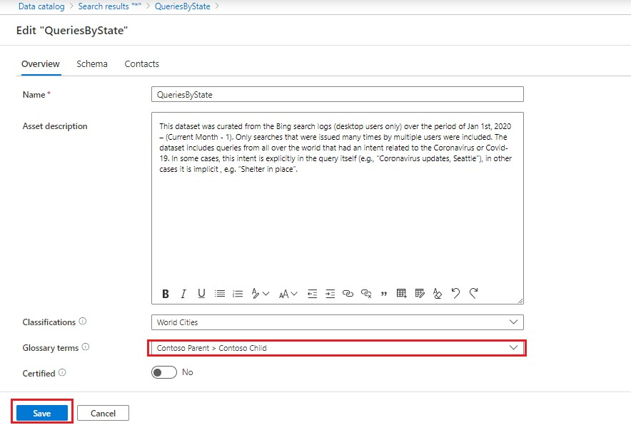

4. Click on the hyperlinked term name to view the glossary term details.

   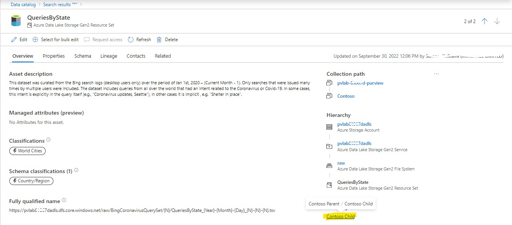

5. Click **Refresh** to view the **Catalog assets** the term is assigned to.

   

## Update an Existing Term

1. From the **Glossary** screen, open an existing term (e.g. `Aggregation`).

   

2. Navigate to the **Related** tab and click **Edit**.

   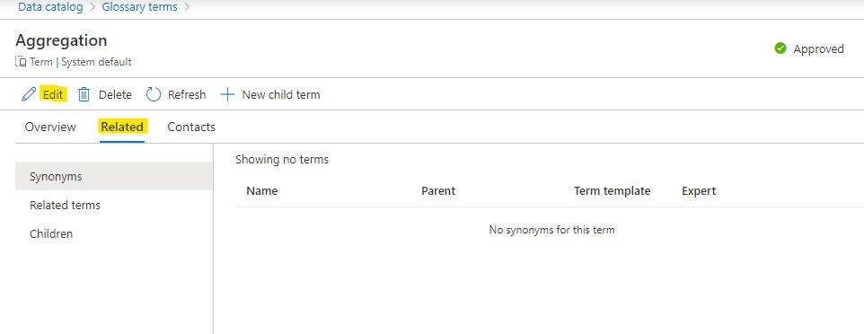

3. Use the drop-down menu to assign two glossary terms as **Synonyms**.

   **Synonyms** are other terms with the same or similar definitions. Whereas **Related terms** are other terms that are related but have different definitions.

   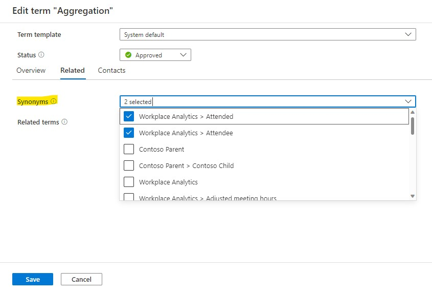

4. Use the drop-down menu to assign two glossary terms as **Related terms**.

   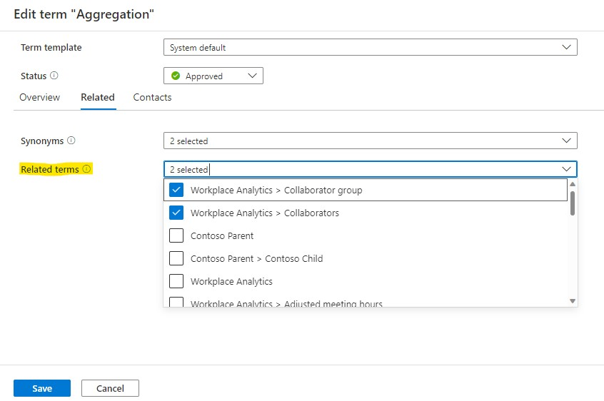

5. Navigate to the **Contacts** tab, click **edit** and assign an **Expert** and a **Steward**. Click **Save**.

   Glossary terms can be related to two different types of contacts. **Experts** are typically business process or subject matter experts. Where as **Stewards** define the standards for a data object or business term. They drive quality standards, nomenclature, rules.

   

## Un-Assign a Term to an Asset 

	⚠️ After trying un-assignment of terms make sure you add them back as this will be used later in search and browse demo

   1. Perform a wildcard search by typing asterisk * into the search bar and press Enter key to submit the query.
   
      
      
   2. Click **Edit**.
   
      

   3. Open the Classification drop-down and unselect World cities, Glossary terms drop-down and unselect a glossary term (e.g. Contoso Child). Click Save.

      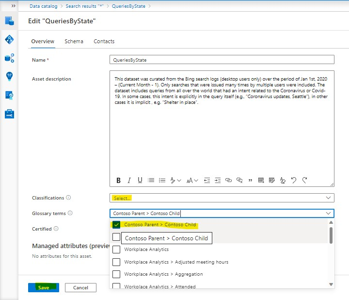

   4. Click on the hyperlinked term name to view the glossary term. You can see that **No Glossary Terms** available.

      
      
   [⏮️ Previous Module](../04_searching-and-editing-assets/documentation.md) - [Next Module ⏭️ ](../06_approval-workflow-for-business-terms/documentation.md)
