# Classifications

In Microsoft Purview, classifications are similar to subject tags, and are used to mark and identify data of a specific type that's found within your data estate during scanning. 
Classifications help you to better manage your data. You can use them for prioritizing your data efforts or improve data security and regulatory compliance. Classifications also improve user productivity and decision-making, and allow you to reduce costs by classifying and finding unused data.
Azure Purview provides a large set of default classifications that represent typical data types that might exist in your data estate *(e.g. email address, credit card number, passport number, etc)*. You also have the ability to create custom classifications if any of the default classifications don't meet your needs.

In this module you will learn how to create a custom classification.

## Prerequisites

* An *Azure account* with an *active subscription*.
* A **twitter_handles.csv** and **twitter_handles.pparquet** files in the **pvlab{randomid}adls** storage account. 
* User should have *Data Curator*, *Data Reader* and *Data Source Admin* Roles.

## Objectives

* Create a custom classification
* Create a Classification Rule
* Create a Scan Rule Set
* Trigger a scan that will apply the custom classification to an asset
* Search by Classification

## Create a Classification

1. Open the **Microsoft Purview Governance Portal**, navigate to **Data map** > **Classifications** under *Annotation management* and click **New**.

    

2. Populate the values below into the appropriate fields and click **OK**.

   Field | Definition
   --- | ---
   **Name** | ``Twitter Handle ``
   **Description** | ``The username that appears at the end of your unique Twitter URL.``

    

3. Navigate to the **Custom** tab to confirm the custom classification has been created.

    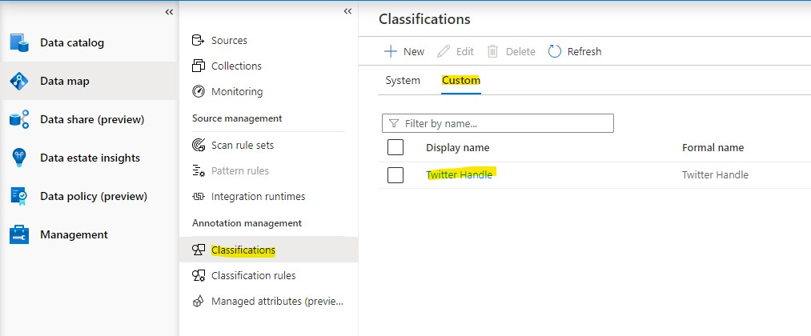

## Create a Custom Classification Rule

1. Navigate to **Data map** > **Classification rules** under *Annotation management* and click **New**.

    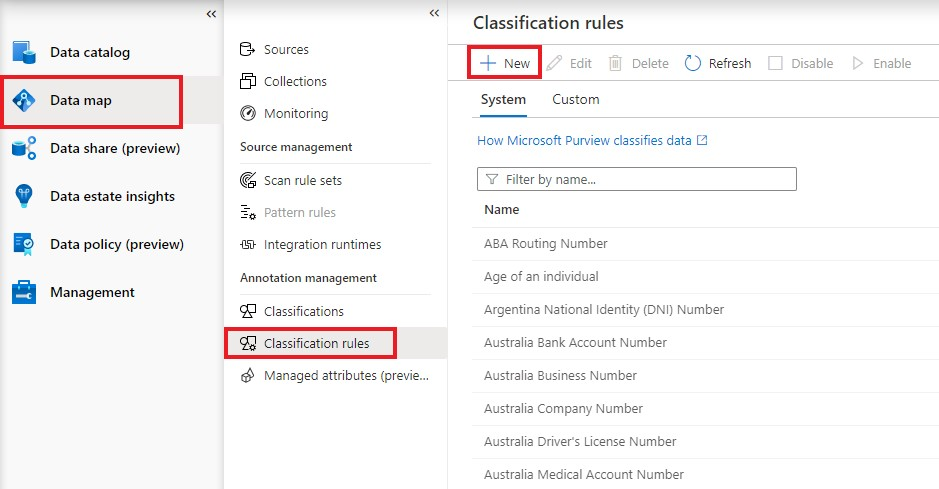

2. Populate the classification rule fields as given below and click **Continue**.

    | Field  | Value |
    | --- | --- |
    | **Name** | `twitter_handle` |
    | **Description** | `The username that appears at the end of your unique Twitter URL.` |
    | **Classification name** | `Twitter Handle` |
    | **State** | `Enabled` |
    | **Type** | `Regular Expression` |

    
    > There are two types of classification rules. **Regular Expression** performs pattern matching against the actual data and/or column name. 
    > Where as **Dictionary** based classification rules allows us to supply a list of all possible values via a CSV or TSV file.

    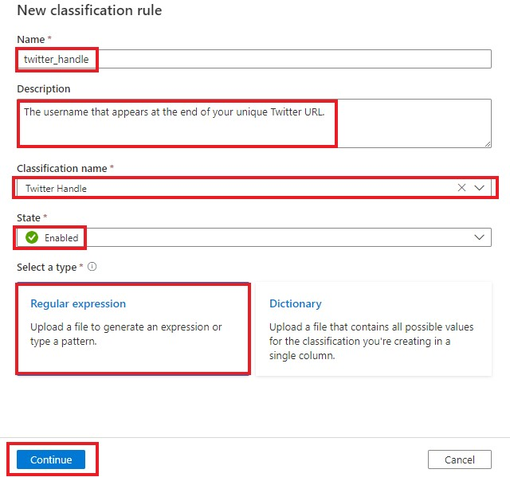

3. Download a copy of **twitter_handles.csv** file from the **pvlab{randomid}adls** storage account and save it.
   
   **pvlab{randomid}adls** -> **raw** -> **Twitter** folder -> **twitter_handles.csv** -> **Download**

    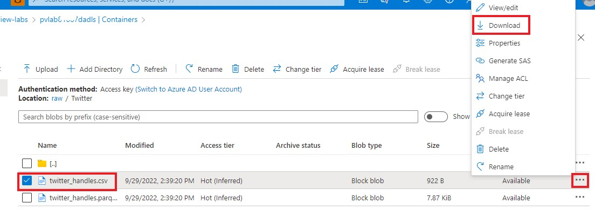

4. Click the **Browse** icon and open the local copy of **twitter_handles.csv**.

    

5. Select the data pattern associated to the **Handle** column and click **Add to patterns**.

6. Modify the Data Pattern by replacing the plus symbol (`+`) with with `{5,15}`.

    * The plus symbol (`+`) indicates one or more characters matching the preceding item. This may lead to false positives as it would allow for an unlimited number of alphanumeric characters. 
    * Twitter handles must be a minimum of 5 and a maximum of 15 characters.
    * With `{5,15}`, this will ensure matches only occur where there is a at least 5 and at most 15 occurrences of the preceding item.

    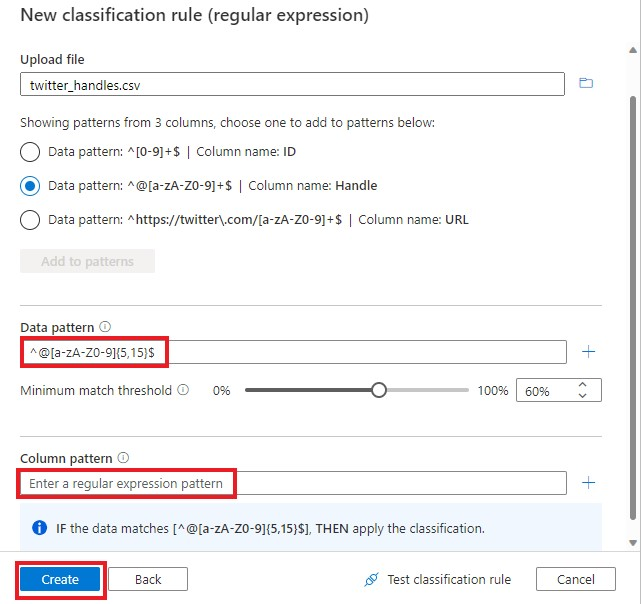

7. While we can also specify a **Column Pattern**, in this example we will rely solely on the Data Pattern. Clear the **Column Pattern** input and click **Create**.

## Create a Scan Rule Set

1. Navigate to **Data map** > **Scan rule sets** under *Source management* and click **New**.

    > **Scan Rule Sets** determine which **File Types** and **Classification Rules** are in scope. 
    > If you want to include a custom file type or custom classification rule as part of a scan, a custom scan rule set should be created.

    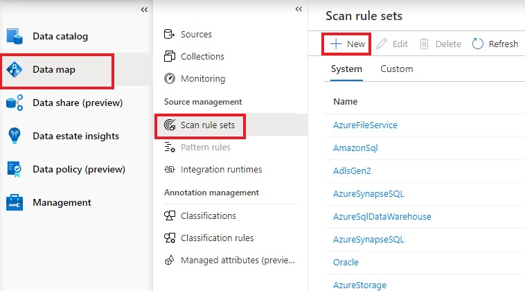

2. Change the **Source Type** to `Azure Data Lake Storage Gen2` then fill the values below into the appropriate fields. Click **Continue**.
    
    Field | Definition
    --- | ---
    **Scan Rule Set Name** | ``twitter_scan_rule_set``
    **Scan Rule Set Description** | ``Custom scan rule set to detect parquet files and classify twitter handles.``

    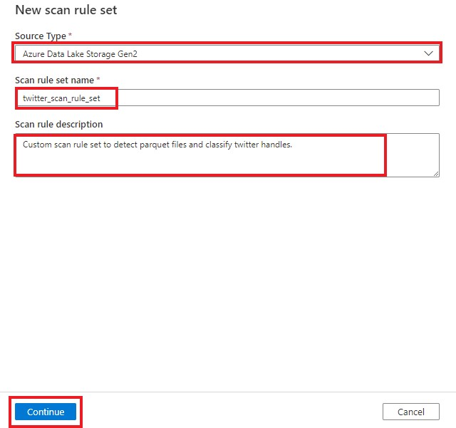

3. Clear all file type selections. Select only **PARQUET** and click **Continue**.

    

4. Clear all selected **System rules** and select the custom classification rule **twitter_handle** and click **Continue**.

    

5. Under **Ignore Patterns** make no changes and click **Create**.

    > **Ignore patterns** tell Microsoft Purview which assets to exclude during scanning. 
    > During scanning, Microsoft Purview will compare the asset's URL against these regular expressions. 
    > All assets matching any of the regular expressions mentioned will be ignored while scanning.

    

## Scan an Azure Data Lake Storage Gen2 Account

1. Go to **pvlab{randomid}adls** storage account in the *Azure portal* and check whether the *twitter_handles.parquet* file is available.
   
   **pvlab{randomid}adls** -> **raw** -> **Twitter** folder -> **twitter_handles.parquet** file
   
   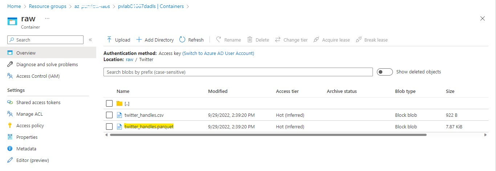
   
2. Open the **Microsoft Purview Governance Portal**, navigate to **Data map** > **Sources** and click **New Scan** within the **Azure Data Lake Storage Gen2** tile. 

    

3. Click **Test connection** to ensure the credentials have access and click **Continue**.

    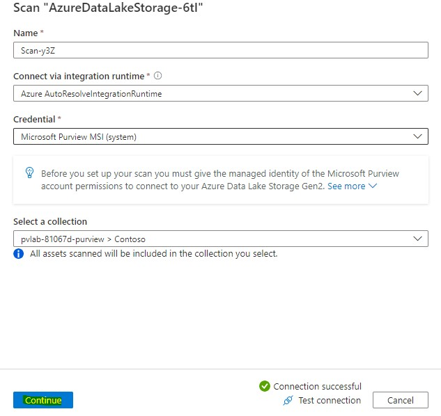

4. By default, Microsoft Purview will have the parent Azure Data Lake Storage Gen2 account selected and therefore include all paths in scope. To reduce the scope, deselect the parent and select the **Twitter** folder only. Click **Continue**.

    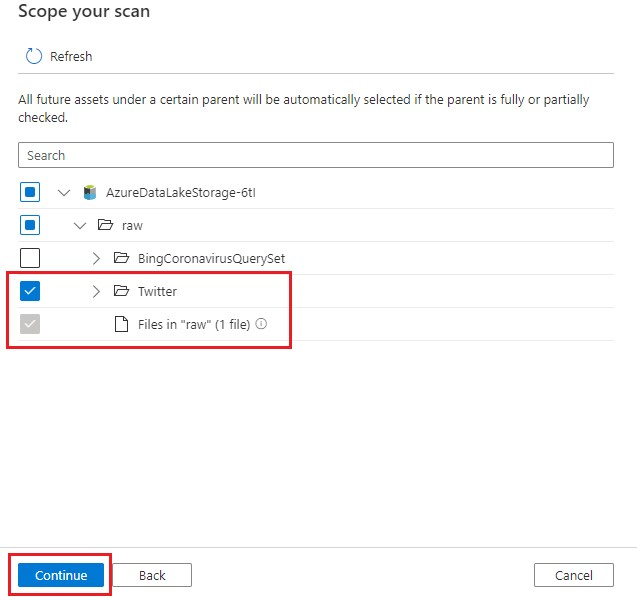

5. To validate the scope of the custom scan rule set, click **View detail**.

    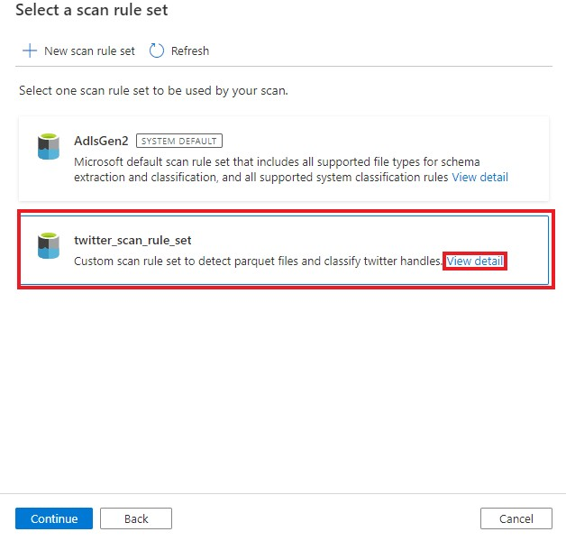

6. Confirm that the custom scan rule set includes the **PARQUET** file type and the custom classification rule **twitter_handle**. Click **OK**.

    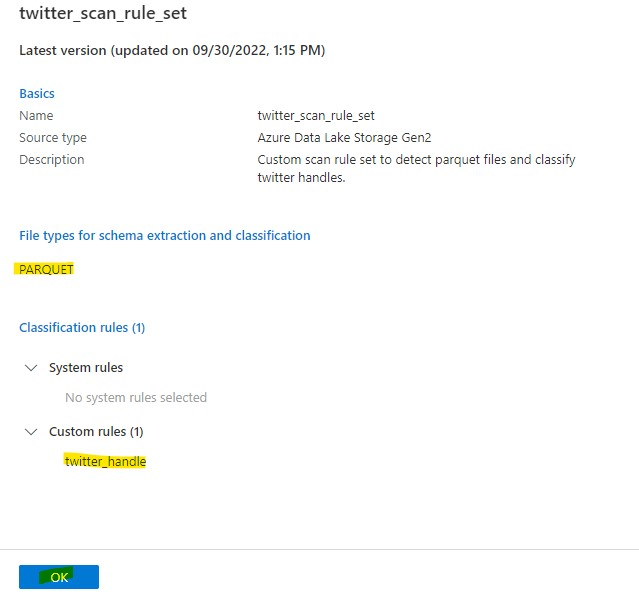

7. Select the custom scan rule set **twitter_scan_rule_set** and click **Continue**.

    

8. Set the scan trigger to **Once** and click **Continue**.

    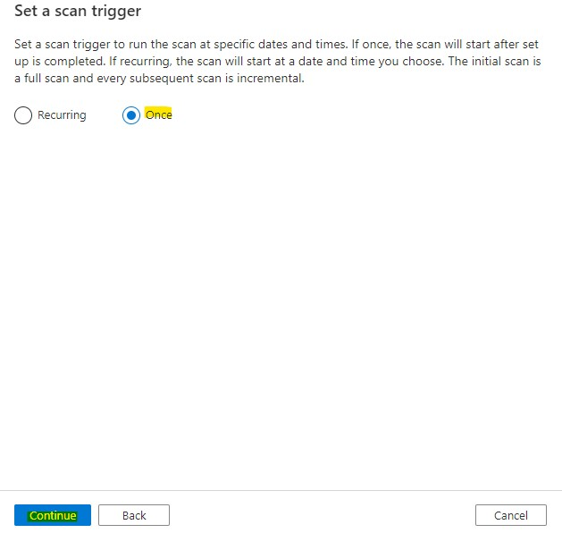

9. Click **Save and Run**.

    

10. To view the progress of the scan, navigate to **Sources** and click **View details** on the **Azure Data Lake Storage Gen2** tile.

    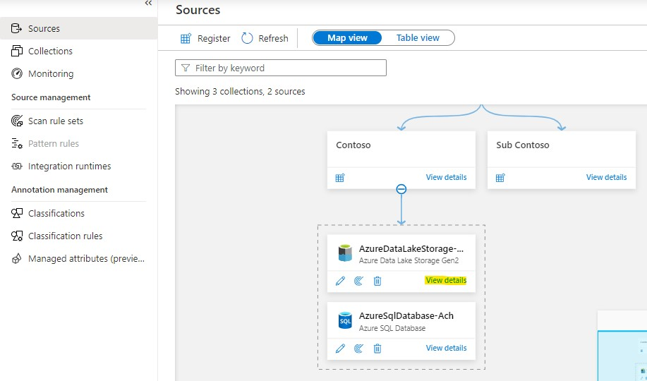

11. Periodically click **Refresh** to update the scan status until **Complete**. 
    
    > This will take approximately 5 to 10 minutes.

    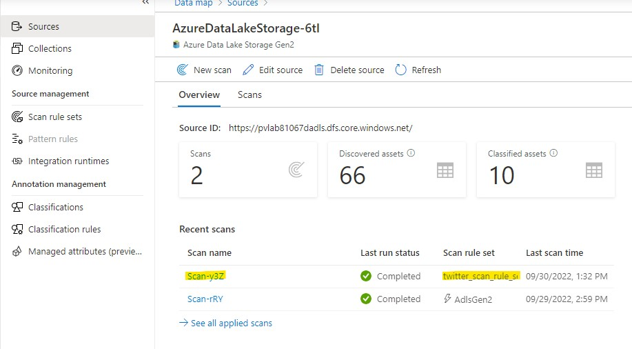

## Search by Classification

1. Once the scan has complete, perform a wildcard search by typing in the asterisk character (**\***) into the search bar and hit Enter.

2. Limit the search results by setting **Classification** within the filter panel to **Twitter Handle**. Click on the asset title (**twitter_handles.parquet**) to view the asset details.

    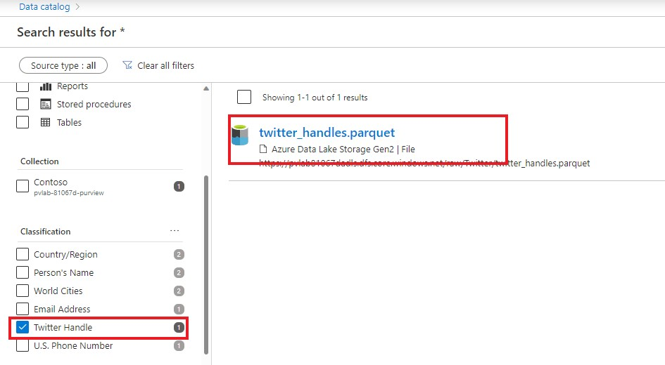

3. You will notice on the Overview tab that the schema includes the Twitter Handle classification. To identity which column has been classified, navigate to the **Schema** tab.

    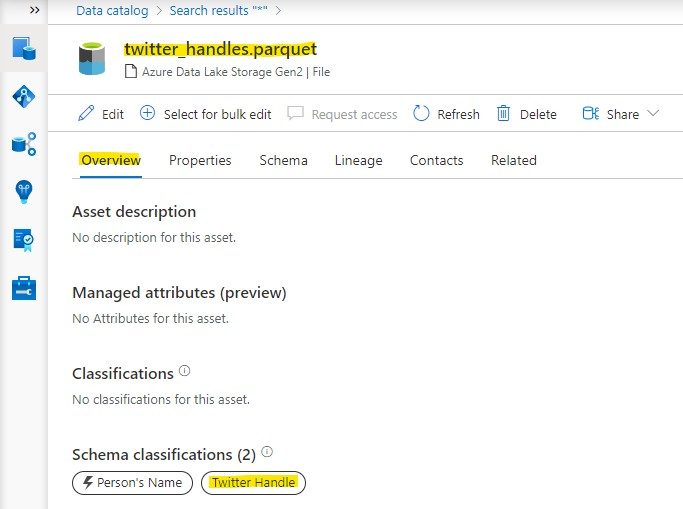

4. Within the Schema tab we can see that **Account name** is the column that has been classified.

    
    
