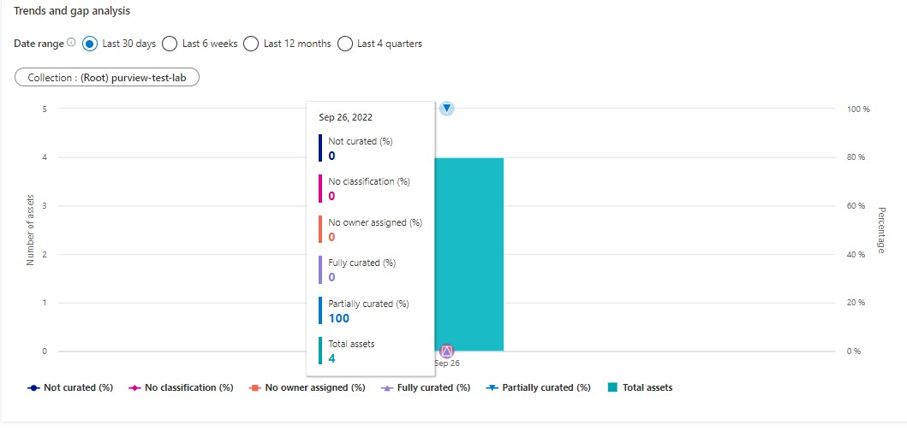
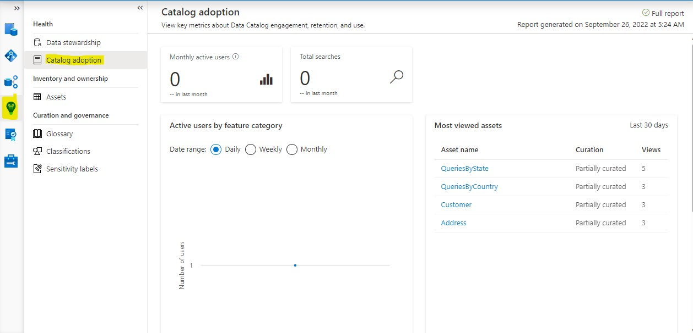
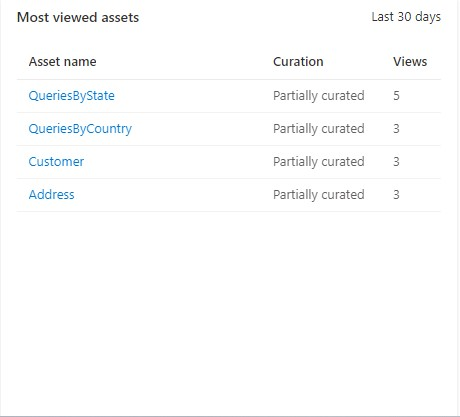
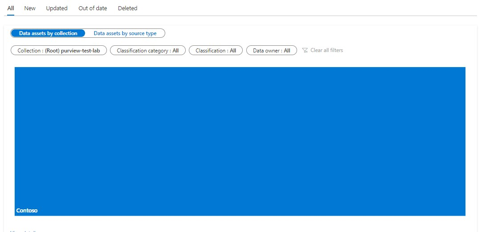
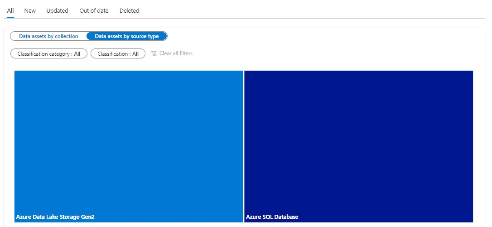
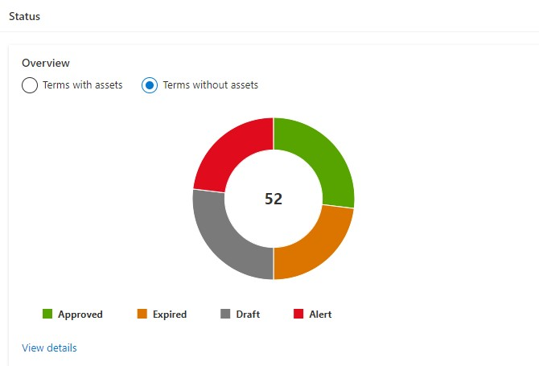
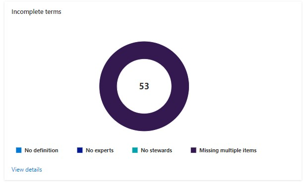
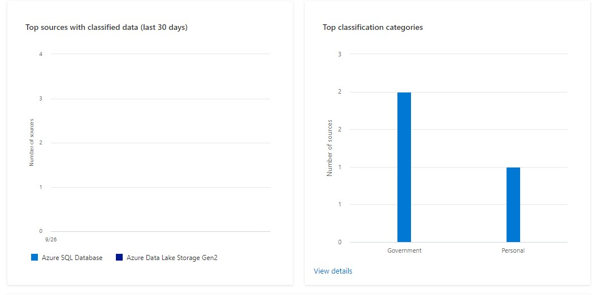
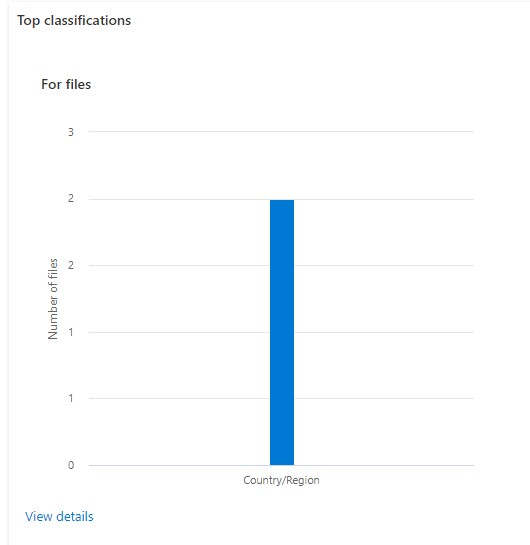
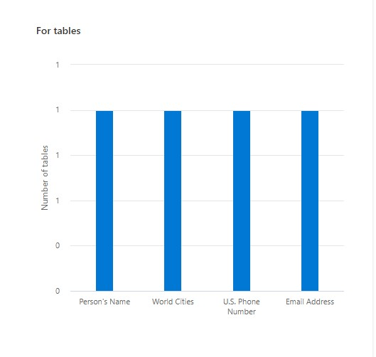

# Insights

Insights provides customers, a single pane of glass view into their catalog and further aims to provide specific insights to the data source administrators, business users, data stewards, data officer, and security administrators.

Microsoft Purview currently has the following reports available:
- **Health**
  - Data stewardship : View key metrics about your data estate's health and performance.
  - Catalog adoption : View key metrics about Data Catalog engagement, retention, and use.
- **Inventory and ownership**
  - Assets : View key metrics about your data estate's assets.
- **Curation and governance**
  - Glossary insights : View key metrics about glossary terms.
  - Classifications : View key metrics about the classifications applied to sources, files, and tables.
  - Sensitivity labels : View key metrics about the sensitivity labels applied to sources, files, and tables.

```diff
!                               << PLEASE READ BEFORE PROCEEDING >>                                
!                                                                                                  
! * Data Estate Insights can take several hours to surface post the completion of a scan.          
! * At this point of the workshop, only a limited number of data visualisations may be populated.  
! * To populate all reports with data, Microsoft Purview requires an environment with a variety of 
! sources and assets to be scanned that is beyond the scope of this workshop.                      
! * The screenshots and information below, has been provided so that you can conceptualise the type
! of insights that can be gleaned from a fully populated environment.                              
```

## Prerequisites

* An *Azure account* with an *active subscription*.
* A Microsoft Purview account.
* *Scanned assets* within the Purview account.
* Users should have *Insights Readers* role in the root collection.

## Objectives

* Data Stewardship Insights
* Catalog Adoption
* Assets Insights
* Glossary Insights
* Classification Insights
* Sensitivity Labels Insights

## Data Stewardship Insights

View key metrics about your data estate's health and performance.

1. Open the **Microsoft Purview Governance Portal**, navigate to **Data estate insights** > **Data stewardship**.

2. The Data Stewardship page displays the following **high-level metrics**.
    * **Asset Duration**
    * **Asset Data Ownership**

    

3. Further down the page you will find additional **data visualizations**, typically these tiles will allow interactive filtering and the ability to drill-down into the underlying detail by clicking **View details**. The Data Stewardship page includes the following **graphs**:

    **Data estate health**

    ")

    **Asset curation**

    

    **Trends and gap analysis**

    

## Catalog Adoption

View key metrics about Data Catalog engagement, retention, and use.

1. Open the **Microsoft Purview Governance Portal**, navigate to **Data estate insights** > **Catalog Adoption**.

2. The Catalog Adoption Page displays the following metrics:
    - Monthly Active Users
    - Total searches

    
    
3. Following are the graphs displayed.
    - **Active Users by Features Category**

        
        
    - **Most Viewed Assets**

        
        
    - **Top Searched Keywords**

        
        
## Assets Insights

View key metrics about your data estate's assets.

1. Open the **Microsoft Purview Governance Portal**, navigate to **Data estate insights** > **Assets**.

2. The Assets page displays the following **high-level metrics**.
    * **Total Assets**
    * **Assets Classification**
    * **Access Data Ownership**
    * **New Assets (Last 30 days)**
    * **Deleted Assets (Last 30 days)**

    

3. The Assets page includes the following **graphs**:

    **Data assets by collection or source type**

    

    
    
## Glossary Insights

View key metrics about glossary terms.

1. Open the **Microsoft Purview Governance Portal**, navigate to **Data estate insights** > **Glossary**.

2. The Glossary page displays the following **high-level metrics**.
    * **Total Terms**
    * **Approved Terms without Assets**
    * **Expired Terms with Assets**

    

3. The Glossary page includes the following **graphs**:

    **Terms with and without assets**

    
    
    

    **Incomplete terms**

    

    > Terms are considered **incomplete** if they are missing a definition, expert, or steward. If a term is missing more than one of these things, it is shown as **Missing multiple items**.

## Classifications Insights

View key metrics about the classifications applied to sources, files, and tables.

1. Open the **Microsoft Purview Governance Portal**, navigate to **Data estate insights** > **Classifications**.

2. The Classifications page displays the following **high-level metrics**.
    * **Total Assets Classified**
    * **Files Classified**
    * **Tables Classified**
    * **Unique Classifications found**
    * **Sources Classified**

    

3. The Classifications page includes the following **graphs**:

    **Top sources with classified data (last 30 days)**

    **Top classification categories**

    

    **Top Classification for Files**

    

    **Top Classification for Labels**

    

## Sensitivity labels Insights

View key metrics about the sensitivity labels applied to sources, files, and tables.

> ⚠️ Since we have not scanned the assets with sensitivity labels, we cannot view the sensitivity insights for this demo.

1. Open the **Microsoft Purview Governance Portal**, navigate to **Data estate insights** > **Sensitivity labels**.

    **Sensitivity labels** state how **sensitive** data is in your organization. 
    *For example*, data contained within a particular asset might be `highly confidential`. 
    **Classifications** on the other hand indicate the **type** of data values (e.g. Driver's License Number, Email Address, SWIFT Code, etc).
    Microsoft Purview's ability to apply sensitivity labels is controlled within the **Microsoft Purview Compliance Portal**. 
    
    > Note: You must have an active Microsoft 365 license that offers the benefit of automatically applying sensitivity labels.

    

2. The Sensitivity Labels page displays the following high-level metrics.
	  - Total assets labeled
    - Files labeled
    - Tables labeled
    - Unique labels found
    - Sources labeled

3. The Sensitivity Labels page includes the following **graphs**:
    - Top sources with labeled data (last 30 days)
    - Top labels applied across sources
    - Number of Files by Label
    - Number of Tables by Label

[ ⏮️ Previous Module](../08_track-data-lineage-by-connecting-azure-data-factory/documentation.md) - [Next Module ⏭️](../10_create-and-manage-data-policy/documentation.md)
