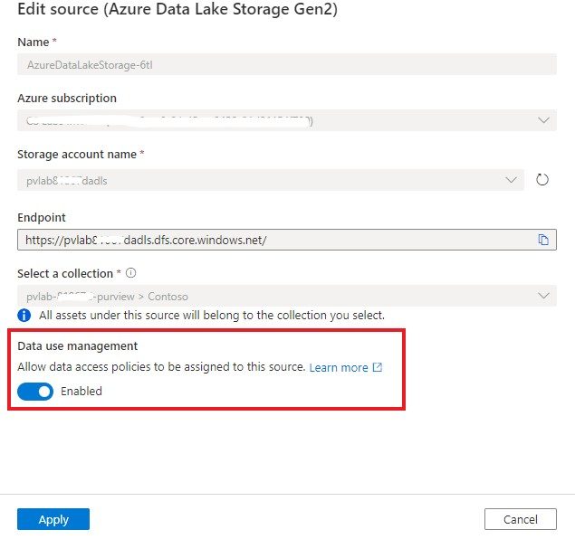
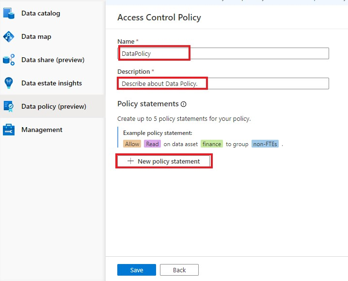
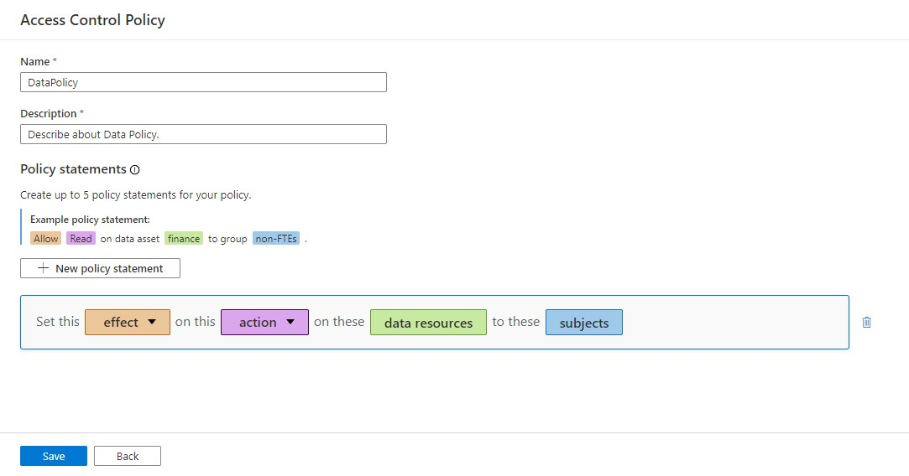
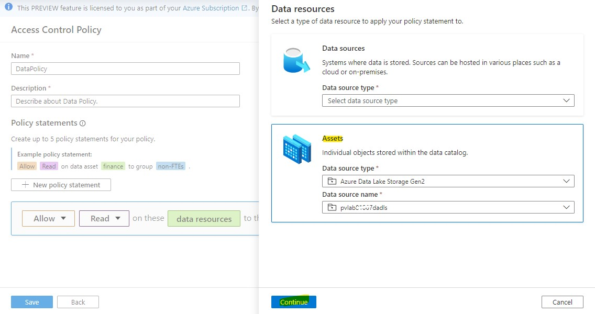
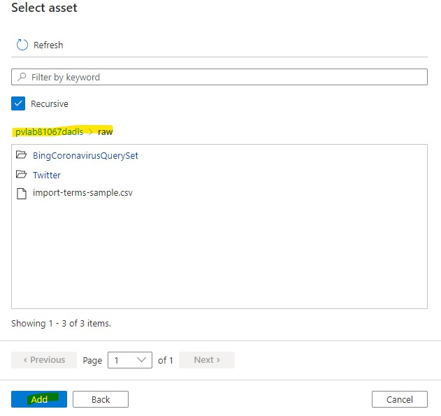
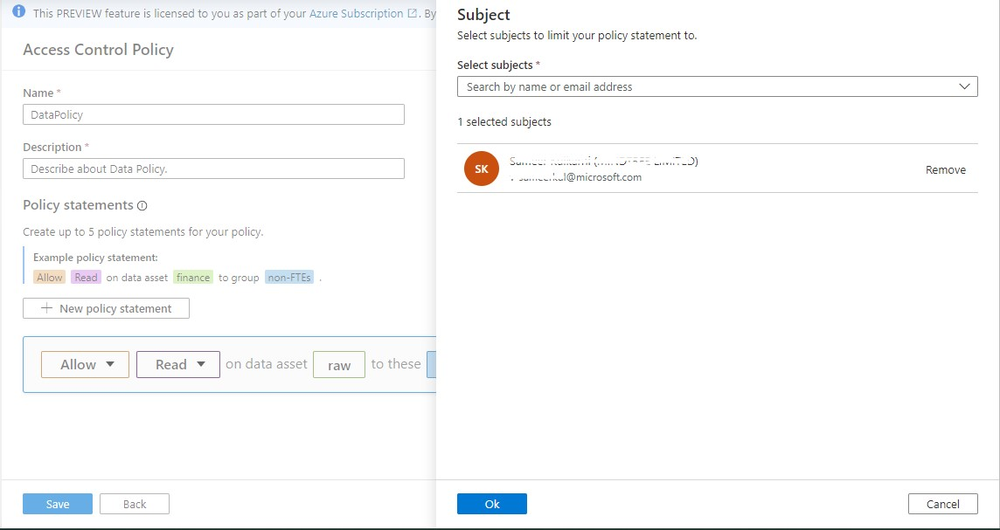
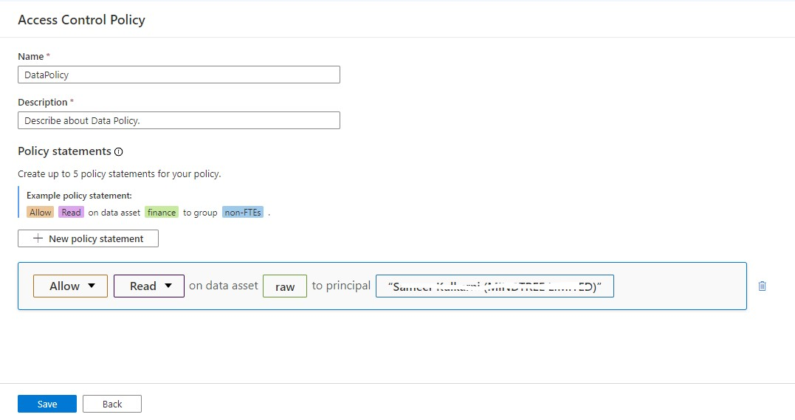
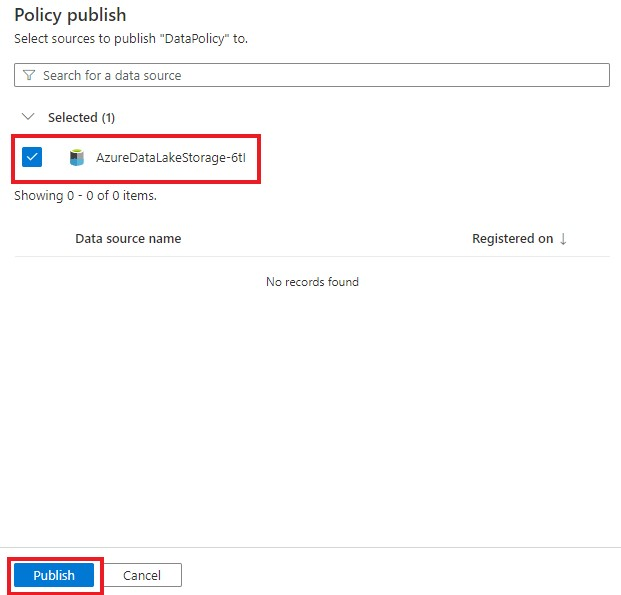

# Data policy

A new feature of Purview is Policies, which enables you to secure your data estate from within the Microsoft Purview Governance Portal.

Data access policies can be enforced through Purview on data systems that have been registered in Purview for scanning and data use management. 
This feature allows Data stewards and owners to grant read, write access to various data stores from within Purview by creating a data access policy through the Policy Management app in the governance portal, enabling a single dashboard view of all access granted to all systems.

A **policy** is a named collection of policy statements. When a policy is published to one or more data systems under Purview’s governance, it's then enforced by the system. 
A policy definition includes a policy name, description, and a list of one or more policy statements.

## Prerequisites

* An Azure account with an active subscription.
* A Microsoft Purview account is already created and scanning of all assets is completed.
* User should have permissions to enable the Data Use Management (DUM) toggle for a data source, resource group, or subscription.
* User should have *Policy Author*, *Collection Admin* and *Data Source Admin* permissions in the Role Assignments.

## Objectives

* Enable Data Use Management
* Create a new policy
* Publish Policy
* Update or delete policy

## Enable Data Use Management

To make a data resource available for policy management, the Data Use Management (DUM) toggle needs to be enabled. 

After a source is registered, edit the source. Set the **Data Use Management** toggle to **Enabled** as shown below.

Open microsoft purview governance portal, 
navigate to **Data map** > **Sources** > select **ADLS Gen 2 source** (*e.g.  AzuredataLakeStorage-cpa*) > click **Edit** > **enable** Data Use Management > Hit **Apply**.

    

## Create a New Policy

1. In the Microsoft Purview governance portal, navigate to the **Data policy** feature using the left side panel as shown. Click **New Policy**

    

2. On the new policy page, enter the **Name** and **Description** of the policy and select the **New policy statement** button, to add a new policy.

    

3. Select the **Effect** dropdown and choose **Allow**.
4. Select the **Action** dropdown and choose **Read** or **Modify**.
5. Select the **Data Resources** button This will bring up a window to enter the Data resource information. Use the **Assets** box and enter the **Data Source Type** and the **Name** of a previously registered and scanned data source.

    
    
    

6. Select the **Continue** button and transverse the hierarchy to select and underlying data-object (for example: folder, file, etc.). Select **Recursive** to apply the policy from that point in the hierarchy down to any child data-objects. Then select the **Add** button. This will take you back to the policy editor.

    

7. Select the **Subjects** button and enter the subject identity as a principal, group, or MSI. Then select the **OK** button. This will take you back to the policy editor

    

8. Select the **Save** button to save the policy.

    

## Publish Policy

A newly created policy is in the draft state and once published the Policy will take some time to get in effect as it needs to get replicated to source through background process.

1. Select the newly created policy from the list of policies on the the Policy portal. Select the **Publish** button on the right top corner of the page.

    
    
    

2. A list of data sources is displayed. You can enter a name to filter the list. Then, select each data source where this policy is to be published and then select the **Publish** button.

    
    
## Update or Delete Policy

1.	Navigate to the Data policy. Then select Data policies.

    
    
2.	From List select the policy e.g test1 which need to be updated or delete i.e. Edit/Delete
    
    
    
> After making changes to a policy, there is no need to publish it again for it to take effect if the data source(s) continues to be the same.

[ ⏮️ Previous Module](../09_view-data-insights/documentation.md)
